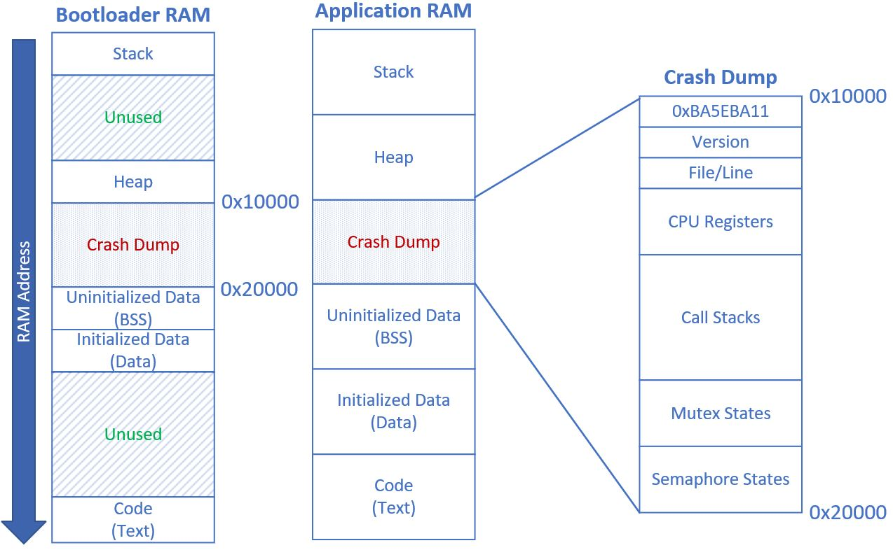
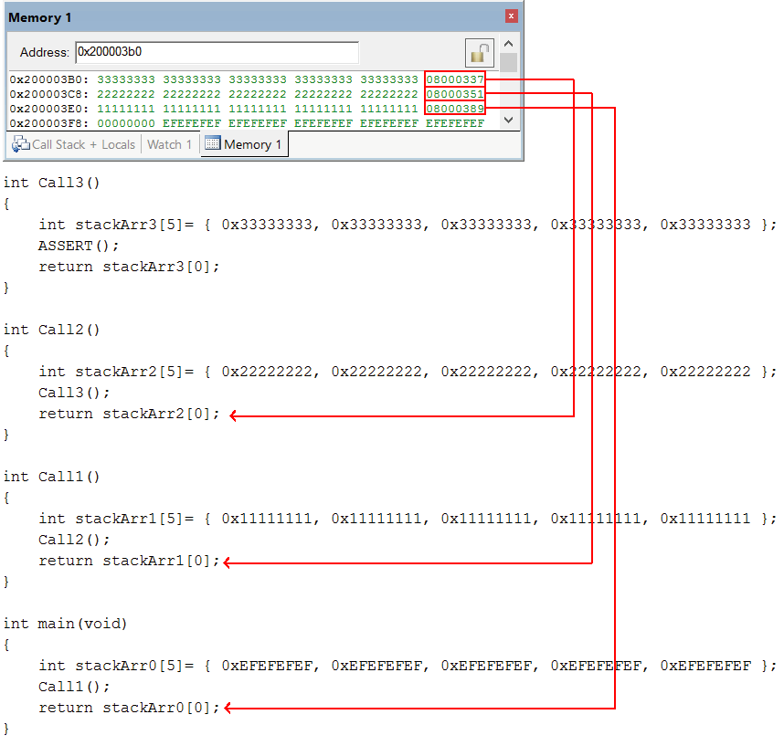
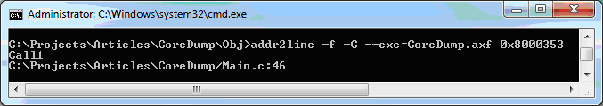
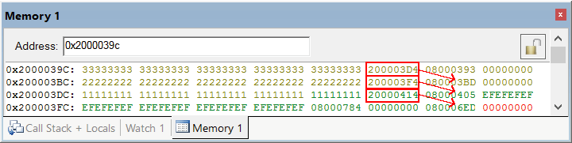
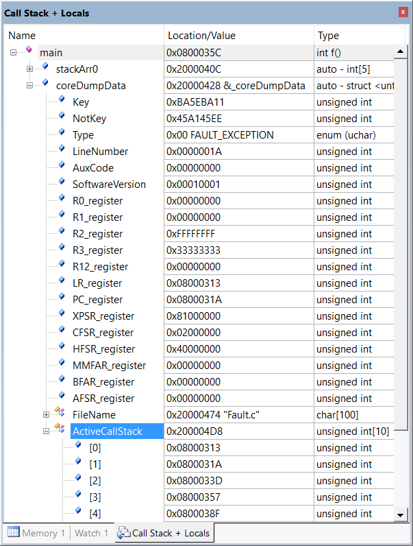

# Overview

A core dump framework that stores crash information including call stacks on any embedded system.

# Introduction

Embedded software development can be quite difficult, especially when trying to solve intermittent software failures. A core dump, or sometimes called a crash dump, is a means of capturing a "snapshot" of the CPU and software state at moment of failure. Whereas large, full-featured operating systems like Windows and Linux already have built-in crash dump capabilities, embedded systems typically aren't equipped with such luxuries. Yet these systems are the ones most in need of a post-mortem diagnostic utility. Embedded systems are increasingly complex with threads, drivers, interrupts and lots of low-level custom crafted code – things are bound to go wrong in difficult to diagnose ways. 

The techniques discussed within this article show exactly how to create a very useful core dump feature with a minimal amount of code. Generic algorithms are suitable for almost any CPU. No specific hardware is required to implement the techniques shown here. This article covers the following topics.

1.	Core dump development tool requirements
2.	Storing the active call stack
3.	Storing call stack for all threads
4.	Storing hardware exception registers
5.	Tapping into the OS task control block (TCB)
6.	Core dump persistence and transmission
7.	Core dump analysis

The Core dump source code builds on any compiler. Serach for `TODO` comments for platform-specific implementation details that must be implemented for deployment.

After reading this article, you'll have a full understanding of the techniques used to implement a core dump utility for your project.  

# Background

Over the years, I've struggled to solve random crashes on mission-critical embedded devices. That last 1% of the project just drags on and on trying to gain enough reliability for release. Run twenty devices overnight, and the next morning most have failed with few clues to why. Not good. 

Simple software assertion logging doesn't go far enough to capture the type of real-world hardware exceptions and software faults that can occur. Memory access violations, divide by 0, deadlocks, stuck threads, and more require better diagnostic capabilities. Even hardware instability problems can falsely manifest itself as a software failure. Infrequent crashes or products in the field mean using debuggers is impractical. 

When designing my first core dump utility, I found disjointed and incomplete information on the subject. While some information existed, what I found missing was a complete core dump example addressing all aspects of implementation. Bits and pieces explained capturing maybe a few registers. But what if I wanted a stack trace for active thread, or all threads? What data should be stored, and where, and how to get the information off the device? How is the crash data analyzed? 

By its nature, a core dump is a very platform-specific feature that changes based upon the processor architecture, hardware design, development tools and operation system. The basic tenet of capturing and persisting crash information, however, crosses all those boundaries. This article provides guidance on development techniques regardless of the target device.

# Core Dump High-Level Process

An embedded core dump follows a process starting at the crash event until a developer decodes the crash data for crash analysis. 

1.	Crash occurs (either from a software assertion or hardware exception)
2.	Store crash soruce code location file name and line number into non-initialized RAM
3.	Store call stack addresses and critical processor registers into non-initialized RAM
4.	Store unique crash dump key in non-initialized RAM
5.	Programmatically reboot CPU
6.	Read unique crash dump key
7.	If crash dump key set, move crash data from non-initialized RAM storage to persistent storage (e.g. file system)
8.	Later, move flash crash data off the device (USB, Bluetooth, etc…) for developer analysis
9.	Developer decodes crash data call stack addresses using a custom core dump decoder tool 

# Core Dump API

The core dump API is shown below:

```cpp
/// Store core dump data.
/// @param[in] stackPointer - the current call stack pointer or 0.
/// @param[in] fileName - file name causing error
/// @param[in] lineNumber - line number causing error
/// @param[in] auxCode - any additional number, or 0
void CoreDumpStore(uint32_t* stackPointer, const char* fileName,
    uint32_t lineNumber, uint32_t auxCode);

/// Get the core dump saved state
/// @return Returns true if core dump data is saved.
bool IsCoreDumpSaved();

/// Get core dump data structure
/// @return A pointer to the core dump data structure.
CoreDumpData* CoreDumpGet();

/// Reset core dump data structure.
void CoreDumpReset();
```
# Development Tools

A core dump requires tools and techniques that are less well known but critical to the implementation. The following is a checklist of items that you’ll need.

1.	Address-to-line tool
2.	No zero-initialize RAM section
3.	Persistent storage or communication interface
4.	Debugger with memory view

## Address-to-Line

An address-to-line utility is critical to the core dump decoding. The tool converts an address to a source code file name and line number. During the core dump, numerous address locations are stored. To translate each address to a file/line requires this tool. 

Many compiler tool chains come with this utility. For those that do not, you still may be able to find one. For instance, Keil didn’t come with this tool but the GNU Binary Utilities (binutils) within the GCC toolchain has an `addr2line.exe` that's compatible with Keil ARM AXF files (and IAR OUT files). An AXF (OUT) file is the compiler output containing both object code and debug information. The `addr2line` tool takes an executable image file and an address and outputs a source code file name and line number. The one I'm using for ARM is part of the Cygwin binutils package installation. The GCC compiler supports many processors so check the GCC binutils if your compiler doesn't already have this utility. 

## No zero-initialize RAM section

When a software failure occurs, the system is not in a stable state. Any number of errors can be generated preventing the application from continuing. The core dump code needs to quickly capture critical data then reset the CPU. Once the CPU is rebooted, the system should be stable again and the temporary storage is moved to a more permanent location (explained later in the article). 

The temporary storage is just RAM. The trick, however, is to place the core dump data structure in a location that is not zero-initialized at startup. This way, the crash data can be stored and survive a warm boot (i.e. a CPU reset where the power is not removed and RAM contents not lost). 

Keil uses a scatter file to direct the linker where to place data. The snippet below creates a section called `NoInit`. Your compiler may have a different means of creating a no-initialize section.

```cpp 
  ; Create a section for uninitialized data. This prevents zero 
  ; initialized (ZI) data located in NoInit to persist over a CPU reset. 
  RW_IRAM2 +0 UNINIT {
    * (NoInit)
  }
  ```
The `CoreDumpData` structure temporarily stores the core dump data within RAM.

```cpp 
/// Core dump data structure
class CoreDumpData
{
public:
    uint32_t Key;
    uint32_t NotKey;
    uint32_t SoftwareVersion;
    uint32_t AuxCode;
    FaultType Type;

    uint32_t LineNumber;
    char FileName[FILE_NAME_LEN];

#ifdef USE_HARDWARE
    uint32_t R0_register;
    uint32_t R1_register;
    uint32_t R2_register;
    uint32_t R3_register;
    uint32_t R12_register;
    uint32_t LR_register;
    uint32_t PC_register;
    uint32_t XPSR_register;
#endif

    uint32_t ActiveCallStack[CALL_STACK_SIZE];

#ifdef USE_OPERATING_SYSTEM
    uint32_t ThreadCallStacks[OS_TASKCNT][CALL_STACK_SIZE];
#endif
};
```
A pragma is used to place an instance of the structure within the `NoInit` section. This prevents zero initialization of the data when the CPU starts. Your compiler may use a different approach. 

```cpp
#pragma arm section zidata = "NoInit"

static CoreDumpData _coreDumpData;   // This data is not initialized to zero at startup

#pragma arm section zidata
```
## Bootloader No-Init

When a bootloader is employed on a system, the bootloader must define a no-init section within RAM at least the size of `CoreDumpData` to prevent the bootloader application for initializing the RAM to 0 and overwriting the core dump data structure. In practice, making the bootloader no-init section larger than is necessary allows the main application `CoreDumpData` structure to increase in size without re-deploying a new bootloader. 

The memory map below shows an example of a non-init Crash Dump data section common to the bootloader and application within RAM. The C-runtime will not initialize the Crash Dump section so a warm-boot reset will allow moving RAM crash dump data to persistent storage. 



# Persistent storage

The crash data ultimately needs to be persisted to some permanent storage medium. It could be flash memory, EEPROM, or other non-volatile storage local to the CPU. Alternatively, the crash data can be transmitted to another CPU capable of data persistence. The data can be sent over serial, wireless, Ethernet or any other appropriate communication means. I’ve designed systems that propagate crash dump messages down a chain of processors until arriving at one that stores the data. The point being that if a processor can’t save the data locally, transmit it to one that can. 

At startup, sometimes I’ll just put the CPU into a tight loop just transmitting the failure over and over again for another processor to receive. Other times I’ll let the code reboot normally after a crash and in the background perform the core dump transmit. 

Note that a processor reset is necessary before attempting persistence, as data storage will likely require too much of the failed application and processor. Writing crash data locally, or data transmission, at the time of failure can lead to a cascade of additional errors. That's why simply saving information to a pre-defined RAM location and rebooting before trying to save/transmit offers a more robust solution no matter the failure mode. Once cleanly restarted, services not available during the failure, such as the OS or interrupts, are now operational and can be used for moving the crash data somewhere permanent. 

## Debugger with memory view

When creating the core dump stack decoding algorithms, you’ll need a debugger capable of displaying raw memory. Any embedded debugger should support this feature. It’s necessary to view the raw call stack memory in order to determine how the stack frame is constructed. Technically, you can get this from the processor and compiler documentation, but it much easier to view the memory at runtime. I'll explain how to view and interpret the stack shortly.

# CoreDump Project

The CoreDump source implements the core dump feature, yet some details marked with `TODO` comments are platform-specific and must be implemented to achieve a fully functional core dump. A software assertion and a hardware exception are demonstrated. 

The source code for Main.c is shown below. The code simply calls functions three levels deep: `main() -> Call1() -> Call2() -> Call3()`. Inside `Call3()`,  either a divide by 0 hardware exception or a software assertion is generated. Use the `#define HARD_FAULT_TEST` to control which test is run. Both cause a core dump to be stored and the CPU to reboot. 

```cpp
// @see https://github.com/endurodave/CoreDump
// David Lafreniere, January 2024.

// Search TODO in source code for platform-specific details required for deployment
// on an embedded system

#include "Fault.h"
#include "CoreDump.h"
#include "Options.h"

#ifdef HARD_FAULT_TEST
static int val = 2, zero = 0, result;
#endif

//----------------------------------------------------------------------------
// Call3
//----------------------------------------------------------------------------
int Call3()
{
    unsigned int stackArr3[5] = { 0x33333333, 0x33333333, 0x33333333, 0x33333333, 0x33333333 };

#ifdef HARD_FAULT_TEST
    // Cause a divide by 0 exception. HardFaultHandler will be called.
    result = val / zero;
#else
    // Cause a software fault. FaultHandler() will be called. 
    ASSERT();
#endif

    return stackArr3[0];
}

//----------------------------------------------------------------------------
// Call2
//----------------------------------------------------------------------------
int Call2()
{
    unsigned int stackArr2[5] = { 0x22222222, 0x22222222, 0x22222222, 0x22222222, 0x22222222 };
    Call3();
    return stackArr2[0];
}

//----------------------------------------------------------------------------
// Call1
//----------------------------------------------------------------------------
int Call1()
{
    unsigned int stackArr1[5] = { 0x11111111, 0x11111111, 0x11111111, 0x11111111, 0x11111111 };
    Call2();
    return stackArr1[0];
}

//----------------------------------------------------------------------------
// main
//----------------------------------------------------------------------------
int main(void)
{
    // Mark the beginning of the stack with a marker pattern. Each task in the 
    // system needs a marker to define the stack top. Your OS might already do 
    // this, but just incase here is a manual method. 
    unsigned int stackArr0[5] = { STACK_MARKER, STACK_MARKER, STACK_MARKER, STACK_MARKER, STACK_MARKER };

#ifdef USE_HARDWARE
    // Enable divide by 0 hardware exception
    SCB->CCR |= 0x10;
#endif

    // Did a core dump get saved? i.e. Did CPU start due to a FaultHandler or
    // HardFaultHandler reset?
    if (IsCoreDumpSaved() == true)
    {
        // Get the saved core dump data structure
        CoreDumpData* coreDumpData = CoreDumpGet();

        // TODO: Save core dump to persistent storage or transmit.
        // the data to a remote device. Platform-specific implementation detail
        // on where to persist the RAM core dump data to a permanent storage device.

        // Reset core dump for next time. 
        CoreDumpReset();
    }

    // Create call stack by calling a few functions
    Call1();

    return stackArr0[0];
}
```

# Stack Frame

Central to a useful core dump feature is capturing the call stack. As the program executes, functions are called. During a function call the return address, and other stack variables, are pushed onto the stack. When a function exits, the return address is popped off the stack and the processor continues execution at that address. It’s these pushed return address values stored within the stack frame that are of interest in reconstructing the call stack at the time of failure. 

The first thing to find out is the direction of the stack growth, either up or down. The ARM Cortex expands downwards, meaning as the stack grows the stack pointer moves to a lower address. The algorithm works with a stack growing in either direction with a slight tweak to seek upwards or downwards through memory. 

The stack trace algorithm has two possible modes depending on whether your compiler uses a stack frame pointer. The "no frame pointer" version is the most generic and works with any call stack. The "use frame pointer" version is slightly more efficient and, of course, only works with call stacks containing stack frame pointers. Some compilers allow turning the feature on and off (e.g. GCC uses `-fno-omit-frame-pointer`).

The next thing to know is the address ranges for RAM and flash. When viewing raw memory it helps to know where the address is located. On the ARM Cortex STM32F103 simulator, the following address ranges are used:

```txt
Flash = 0x08000000 to 0x0801FFFF
RAM = 0x20000000 to 0x20004FFF
```

To make viewing the stack frame easier, memory markers are added in each function call. These markers are pushed onto the stack to see how it’s constructed. First up: the no frame pointer stack. 


 
The figure above shows the call stack, currently at address 0x200003b0. The stack is four levels deep with each function containing a local array of five integers used as memory pattern markers. In this example, the function call sequence is: 
`main() -> Call1() -> Call2() -> Call3()`. 

`Call1()` is the first level and uses a 11111111 marker. `Call2()`  uses 22222222 and `Call3()` uses 33333333. `main()` uses `EFEFEFEF` to mark the start of the user call stack. 

Now that unique patterns are dispersed throughout the stack, it’s easy to deconstruct its format. Notice the extra value between two sets of markers. For instance, between 33333333 and 22222222 is the value 08000337. This is actually a function return address pushed onto the stack. On ARM, this address comes from the Link Register (LR). When `Call3()` exits, the code will continue execution at address 0x08000337. 

Similarly, the return address for `Call2()` is 0x08000351 as shown between the 2222222 and 11111111 markers. And finally, 0x08000389 is the return address for `Call1()`. 

# Address Decoding

To decode each call stack return address requires a map file, debugger disassembly window, or an address-to-line tool. 
A map file, generated by your linker, shows the location of all functions. Unfortunately, the resolution is a bit coarse and finding an exact address is sometimes not possible. 

```cpp
Call1                        0x0800033f   Thumb Code    28  main.o(.text)
```

A debugger disassembly window is usually able to display the source code at a particular address. On Keil, right click the Disassembly window and select Show Disassembly At Address… Other debuggers have a similar feature. 
 
While viewing the source code line within a debugger is helpful for developing a core dump, ultimately you’ll need an address-to-line tool. The address to decode plus the executable object file is required. The command line example below decodes an address from a Keil AXF file:

`addr2line -f -C --exe=CoreDump.axf 0x8000353`

 

The command line arguments to `addr2line` requires the software executable (i.e. `CoreDump.axf`) and the address to decode (0x8000353). In this case, address 0x8000353 translates to function `Call1()` located in `Main.c` line 46.

# Fault Handling

Now that we’ve created our fault test code, let’s see how to extract and store the call stack. `Fault.c` contains code to handle system faults. The assert macros (e.g. `ASSERT_TRUE`) calls `FaultHandler()` if the check fails. The function just stores the crash information and resets the processor. 

```cpp
void FaultHandler(const char* file, unsigned short line)
{
	// Store software assertion core dump data
	CoreDumpStore(0, file, line, 0);

	// TODO: Reboot CPU here! After reboot, the core dump data is used.
	
	// If you hit this line, it means one of the ASSERT macros failed.
	while (true);
}
```

`HardFaultHandler()` is called when a hardware exception occurs and is called from an interrupt context. For an ARM architecture, during an interrupt context the stack pointer is located in the MSP or PSP register. Once the address of the stack is acquired, the core dump is stored and the CPU reset.

```cpp
void HardFaultHandler(void)
{
	// TODO: Called if a hardware exception is generated. Platform 
	// specific detail. Connect exceptions to call this function.

#if 0 // ARM example begin
	// Determine if main stack or process stack is being used. Bit 2 of the 
	// LR (link register) indicates if MSP or PSP stack is used.
	if ((LR & 0x4) == 0)
		stackPointer = (unsigned int*)MSP;
	else
		stackPointer = (unsigned int*)PSP;
#endif // ARM example end

	uint32_t* stackPointer = nullptr;	// TODO: Store the current stack pointer here
	uint32_t vectorNum = 0;				// TODO: Store the exection vector number here

	// Store hardware exception core dump data
	CoreDumpStore(stackPointer, __FILE__, __LINE__, vectorNum);

	// TODO: Reboot CPU here! After reboot, the core dump data is used.

	// If you hit this line, it means a hardware exception occurred.
	while (true);
}
```

Within `CoreDump.c`, the `CoreDumpStore()` function stores the core dump data into the `_coreDumpData` structure previously placed into the `NoInit` section to prevent zeroing the data at CPU reset. 

```cpp
void CoreDumpStore(uint32_t* stackPointer, const char* fileName,
    uint32_t lineNumber, uint32_t auxCode)
{
    // Is a core dump already stored? Then don't overwrite. The first  
    // core dump is what is needed, not any subsequent crashes detected
    // after the first one.
    if (IsCoreDumpSaved())
        return;

    // Set the key indicating a core dump is stored 
    _coreDumpData.Key = KEY_CORE_DUMP_STORED;
    _coreDumpData.NotKey = ~KEY_CORE_DUMP_STORED;

    _coreDumpData.SoftwareVersion = SOFTWARE_VERSION;
    _coreDumpData.AuxCode = auxCode;

    // If the caller provides a stack pointer it means that this
    // function is being called from an ISR handler and register 
    // values are pushed onto the stack by the CPU. 
    if (stackPointer != 0)
    {
        // Hardware exception occurred!
        _coreDumpData.Type = FAULT_EXCEPTION;

        // Store all the registers located on the stack
        // TODO: Registers pushed onto stack is a platform-specific implementation detail.
        // See your CPU processor, BSP, and/or compiler documentation. 
#ifdef USE_HARDWARE
        _coreDumpData.R0_register = *stackPointer;
        _coreDumpData.R1_register = *(stackPointer + 1);
        _coreDumpData.R2_register = *(stackPointer + 2);
        _coreDumpData.R3_register = *(stackPointer + 3);
        _coreDumpData.R12_register = *(stackPointer + 4);
        _coreDumpData.LR_register = *(stackPointer + 5);
        _coreDumpData.PC_register = *(stackPointer + 6);
        _coreDumpData.XPSR_register = *(stackPointer + 7);
#endif

#ifdef USE_HARDWARE
        // Store other registers to assist with exception decoding as necessary
        // TODO: Obtaining registers and storing is a platform-specific implementation detail.
        // See your CPU processor, BSP, and/or compiler documentation.
        _coreDumpData.CFSR_register = SCB->CFSR;
        _coreDumpData.HFSR_register = SCB->HFSR;
        _coreDumpData.MMFAR_register = SCB->MMFAR;
        _coreDumpData.BFAR_register = SCB->BFAR;
        _coreDumpData.AFSR_register = SCB->AFSR;
#endif
    }
    else
    {
        // Software assertion occurred!
        _coreDumpData.Type = SOFTWARE_ASSERTION;
    }

    // Save file name and line number
    _coreDumpData.LineNumber = lineNumber;
    if (fileName != NULL)
    {
        strncpy(_coreDumpData.FileName, fileName, FILE_NAME_LEN);
        _coreDumpData.FileName[FILE_NAME_LEN - 1] = 0;
    }

    // Get the stack pointer if none passed in
    if (stackPointer == 0)
    {
#ifdef USE_HARDWARE
        // Get current stack location using SP register
        // TODO: Obtaining registers and storing is a platform-specific implementation detail.
        // See your CPU processor, BSP, and/or compiler documentation.
        stackPointer = (uint32_t*)SP;
#endif
    }

    // Save the current call stack
    StoreCallStack(stackPointer, &_coreDumpData.ActiveCallStack[0], CALL_STACK_SIZE);
}
```

The `_coreDumpData` uses two key values to determine if the core dump data is already valid. On a cold boot, the key values will be set to some random value. On a core dump induced warm boot, the key values will be set to `KEY_CORE_DUMP_STORED`. The validity of the RAM code dump data is determined by using the keys values. 

For a hardware exception, a stack pointer is provided to `CoreDumpStore()`. This allows the CPU register values (automatically pushed onto the stack by the processor) to be extracted and placed into the core dump data structure. 
The file name and line number where the assert macro test failed is also saved. Optionally an auxCode can be used which can be used to store error codes into the crash data using the `ASSERT_TRUE_AUX` macro. 

# Stack Capture (no frame pointer)

The last thing `CoreDumpStore()` does is store the active call stack by calling `StoreCallStack()`. This function starts at the top of the stack and works its way down storing any value that fits within the flash address range. The idea is that any number stored inside the stack that lies between `FLASH_BASE` and `FLASH_END` is likely to be a return address pushed during a function call. 

The problem is the core dump code really doesn’t have any idea where these return addresses are located. The top of the stack is easily obtained, but not the precise locations of the return addresses inside the stack. Therefore, checking each 32-bit value against the flash address range is bound to pickup those return address buried inside. 

```cpp
static void StoreCallStack(uint32_t* stackPointer, uint32_t* stackStoreArr, int stackStoreArrLen)
{
    int stackDepth = 0;
    int depth = 0;

    // Clear the core dump call stack storage
    memset(stackStoreArr, 0, sizeof(uint32_t) * stackStoreArrLen);

    // Ensure the stack pointer is within RAM address range
    if (((uint32_t)stackPointer < RAM_BEGIN || (uint32_t)stackPointer > RAM_END))
        return;

    // Search the stack for address values within the flash address range. 
    // We're looking for stored LR (link register) values pushed onto the stack.
    for (depth = 0; depth < MAX_STACK_DEPTH_SEARCH; depth++)
    {
        // Get a 32-bit value from the stack
        uint32_t stackData = *(stackPointer + depth);

        // Have we reached the beginning of the stack?
        if (stackData == STACK_MARKER && *(stackPointer + depth + 1) == STACK_MARKER)
            break;

        // Is the stack value within the flash address range? This is the 
        // check to determine if the address stored within the stack is a 
        // return address. Later, a PC addr2line tool can convert each
        // address to a file name/line number.
        if (stackData >= FLASH_BASE && stackData <= FLASH_END)
        {
            // Save the function address within the core dump structure
            stackStoreArr[stackDepth++] = stackData;
        }

        // Have we reached the maximum stack depth to store?
        if (stackDepth >= stackStoreArrLen)
            break;
    }
}
```

The search for return addresses within the stack continues until either the maximum depth is reached or the start of stack markers are found. Recall `EFEFEFEF` markers are placed in `main()`. When found, the stack start is reached and searching is stopped. Using this simple pattern at every thread entry point offers an easy means to terminate the search. Some operating systems may already place marker patterns at the top/bottom of stack to assist with stack overrun detection.

Now the algorithm isn’t perfect. Sometimes those seemingly valid return addresses are left over from previous function calls. The stack expands and contracts as the program executes, so some return addresses values may be stale. However, in practice this really isn’t a problem. When you capture say a 10 level deep call stack, the fact that one address is nonsensical doesn’t diminish its usefulness. Clearly using a bit of common sense a developer can examine the decoded call stack and ignore an errant function call and still gain a useful understanding of the failure. 

# Stack Capture (use frame pointer)

An alternative stack capture algorithm can be created if your compiler embeds frame pointers into the stack. With Keil, turning on the frame pointer using the `--use_frame_pointer` compiler option yields this stack.

 
 
The frame pointers are marked in red. Notice that the frame pointers point to a return address location further down into the stack making a linked list of frames. For instance, `200003D4` points to function return address `080003DB`.
It's not very difficult to create an alternate algorithm that seeks out the frame pointers and uses those to more effectively extract the return addresses. A valid frame pointer must point further down into the stack but not past the stack start. If the frame pointer fails the check, skip and move to the next value. If the linked list of frame pointers ends up at the `EFEFEFEF` marker, then the algorithm correctly followed the chain. 

The advantage of this algorithm is that once the code syncs up with the frame pointer linked list, it can jump over large chunks of stack variables making it faster. It can also give slightly better call stack results under some conditions. The presented algorithm just uses brute force examination of each 32-bit value picking off addresses that lay within the flash range making it more generic.

# After Reboot

After the core dump is stored, the processor reboots. The `IsCoreDumpStored()` function checks to see if a core dump has been stored at startup. If so, `CoreDumpGet()` is used to get the crash data in readiness for persistence or transmission. `CoreDumpReset()` resets the key values in readiness for the next crash. 

```cpp
int main(void)
{
    // Mark the beginning of the stack with a marker pattern. Each task in the 
    // system needs a marker to define the stack top. Your OS might already do 
    // this, but just incase here is a manual method. 
    unsigned int stackArr0[5] = { STACK_MARKER, STACK_MARKER, STACK_MARKER, STACK_MARKER, STACK_MARKER };

#ifdef USE_HARDWARE
    // Enable divide by 0 hardware exception
    SCB->CCR |= 0x10;
#endif

    // Did a core dump get saved? i.e. Did CPU start due to a FaultHandler or
    // HardFaultHandler reset?
    if (IsCoreDumpSaved() == true)
    {
        // Get the saved core dump data structure
        CoreDumpData* coreDumpData = CoreDumpGet();

        // TODO: Save core dump to persistent storage or transmit.
        // the data to a remote device. Platform-specific implementation detail
        // on where to persist the RAM core dump data to a permanent storage device.

        // Reset core dump for next time. 
        CoreDumpReset();
    }

    // Create call stack by calling a few functions
    Call1();

    return 0;
}
```

Viewing a crash dump within the debugger shows all the data gathered during the fault.  

 
 
# Dump.txt

When extracting the core dump data from the target, it needs to be analyzed on a PC. The core dump data stored or transmitted by the target is going to be compact, but when sent to another host with a file system (flash or HDD), the transmitted core dump data is translated to a text file. The format of the text file is unimportant. It only needs to be easy enough to parse using a core dump decoder tool of your own design. The example below shows a `dump.txt` file contents after translating `CoreDumpData` structure into a text file at startup after a crash.

```txt
Type: Software Assertion
Date: 4/4/2016
Time: 3:39:53 PM
File Name: ..\Reset.c
Line Number: 103
Aux Code: 4
Software Version: 1.1

R0: 0x78cfb5df
R1: 0x46708197
R2: 0x99fe5c0f
R3: 0xa0214018
R12: 0xeb253f23
LR: 0x68467d02
PC: 0x7e9fdcfa
xPSR: 0x490aa000
CFSR: 0x9eed0939
HFSR: 0xa04625b0
MMFAR: 0x36fe8e5e
BFAR: 0x11430031
AFSR: 0xdeabffea

Stack 0: 0x8023c28
Stack 1: 0x8035e58
Stack 2: 0x80238d5
Stack 3: 0x8023ba7
Stack 4: 0x80133dd
Stack 5: 0x8013525
Stack 6: 0x8023c28
Stack 7: 0x8035e58
Stack 8: 0x80238d5
Stack 9: 0x8023ba7
Stack 10: 0x80133dd
```

# Dump.txt Decoder

To automate the decoding of `dump.txt` files, create a custom a PC-based tool to parse the stack addresses and send each one to the address-to-line tool. For instance, a command line tool that you create takes the executable image and a dump text file. The tool automatically parses the addresses and outputs a file/line for each Stack entry. 

`dump_decoder.exe --exe MyApp.axf --txt dump.txt`

The `dump_decoder.exe` implementation is just automating extracting each address from the `dump.txt` file and calling the `addr2line` tool over and over and outputting the translated addresses. For instance, programmatically decoding the stack above is essentially capturing the output of:

```txt
addr2line -f -C --exe=MyApp.axf 0x8023c28    // Stack 0
addr2line -f -C --exe=MyApp.axf 0x8035e58    // Stack 1
addr2line -f -C --exe=MyApp.axf 0x80238d5    // Stack 2
etc...
```

And outputting decoded address to a file such as:

```txt
0: CoreDumpStore()      // Stack 0
    CoreDump.cpp:85

1: FaultHandler()       // Stack 1
    Fault.cpp:7

2: Call3()              // Stack 2
    main.cpp:27

etc...
```

# OS Support

If you stopped here and implemented the core dump as explained so far, you'd have an excellent utility for capturing runtime crashes. Typically, I add more features by tapping into the operating system to:

1.	Store call stacks for all threads
2.	Store the mutex/semaphore owner and blocking threads

These features require accessing the OS task control block (TCB). Typically, a TCB structure exists for each system thread. Each thread has its own stack and the TCB contains, among other things, a thread stack pointer. The `StoreThreadCallStacks()` example shown below is for Keil RTX. The function iterates over all TCB structures and saves the call stack for each thread by calling `StoreCallStack()` repeatedly using each thread's `p_TCB->tsk_stack`.

```cpp
static void StoreThreadCallStacks()
{
#ifdef USE_OPERATING_SYSTEM
    // TODO: The code below assumes that each task has a Task Control Block (TCB).
    // The stack starting location is obtained from the TCB (ie

    int taskCnt = 0;

    memset(_coreDumpData.ThreadCallStacks, 0, sizeof(_coreDumpData.ThreadCallStacks));

    // For each system task
    for (int t = 0; t <= OS_TASKCNT; t++)
    {
        // Is there a task control block?
        if (os_active_TCB[t] == NULL)
            continue;

        P_TCB p_TCB = (P_TCB)(os_active_TCB[t]);
        uint32_t* stackPointer = p_TCB->tsk_stack;

        // Store the call stack for this task
        StoreCallStack(stackPointer, &_coreDumpData.ThreadCallStacks[taskCnt][0], CALL_STACK_SIZE);

        if (++taskCnt >= CRASH_DUMP_TASK_SIZE)
            break;
    }
#endif
}
```

Adding locked mutex and semaphores with blocking threads is also possible using the TCB. This is very helpful to know who owns the lock and which threads are waiting. A deadlock or a thread stuck holding a lock is trivial to solve using this information. Create simple test cases during development to verify your core dump data looks as expected under all scenarios. 

# Conclusion

Over the years, I've solved countless problems using a core dump that would have been near impossible to solve any other way. Once a crash log exposes the root cause, it becomes clear that some bugs are so deeply rooted that normal debugging techniques could never expose them.

